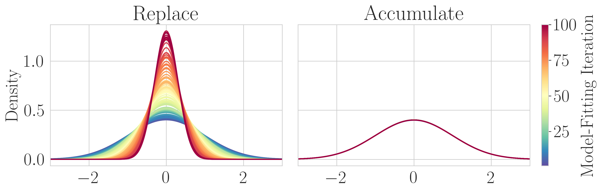
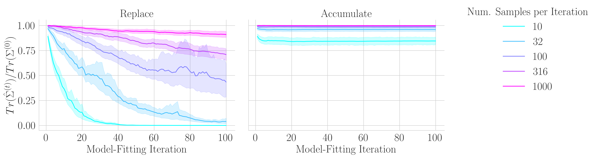
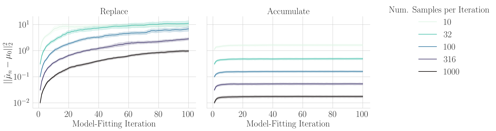

# Collapse or Thrive? Perils and Promises of Synthetic Data in a Self-Generating World

This repository contains code and figures for our paper
[Collapse or Thrive? Perils and Promises of Synthetic Data in a Self-Generating World]().








[//]: # ([![arXiv]&#40;https://img.shields.io/badge/arXiv-2407.15211-df2a2a.svg?style=for-the-badge&#41;]&#40;https://arxiv.org/abs/2407.15211&#41;)

[**Setup**](#setup) | [**Usage**](#usage) | [**Citing**](#citing) | [**Contact**](#contact)

## Setup

(Optional) Update conda:

`conda update -n base -c defaults conda`

Create a conda environment with the required packages:

`conda env create --file environment.yml`

To activate the environment:

`conda activate model_collapse_20240911`

Upgrade pip:

`pip install --upgrade pip`

## Usage

### Multivariate Gaussian Modeling

### Supervised Finetuning of Language Models

This code has two alternating steps: (1) training+evaluation and (2) sampling.

For developing or manually running training+evaluation, from the project directory, run:

```
export CUDA_VISIBLE_DEVICES=0
export PYTHONPATH=.
python -u src/sft_language_model/sft_language_model.py
```

For developing or manually running sampling, from the project directory, run:

```
export CUDA_VISIBLE_DEVICES=0
export PYTHONPATH=.
python -u src/sample_language_model/sample_language_model.py
```

Both load the default hyperparameters from `src/globals.py` and log data to W&B.
The default hyperparameters can be overwritten by W&B sweeps in the directory `sweeps/`.
To run training+evaluation using a W&B sweep, use the following command:

```
export CUDA_VISIBLE_DEVICES=0
export PYTHONPATH=.
# This will return the sweep ID.
wandb sweep <path to the sweep's YML file, e.g., sweeps/sft_language_model/helpsteer2_sweep=gemma_2_2b_data=original_iter1.yaml>
wandb agent rylan/rerevisiting-model-collapse-sft/<sweep ID>
```

To run sampling using a W&B sweep, use the following command:

```
export CUDA_VISIBLE_DEVICES=0
export PYTHONPATH=.
# This will return the sweep ID.
wandb sweep <path to the sweep's YML file, e.g., sweeps/sample_language_model/helpsteer2_sweep=gemma_2_2b_data=original_iter1.yaml>
wandb agent rylan/rerevisiting-model-collapse-sample/<sweep ID>
```

### Kernel Density Estimation

### Linear Regression

### Real and Synthetic Data Proportionality

The proportionality experiments are run by the file `src/sft_language_model/sft_language_model_mixed_data.py`.  

To run a sweep for the proportionality experiments, run 

```
wandb sweep sweeps/sft_language_model/value_synthetic/proportion_of_data_experiment.yaml
```
At present, this sweep creates results for a single number of real and synthetic datapoints, which are specified by num_real and num_synthetic in the `data_config`.  After each run, change the output model path to have the format `num_realR-num_fakeF-gemma-2-2b_hs2_iter1_sftsdXXX`.


## Citing

To cite this work, please use:

```
```

## Contact

Questions? Comments? Interested in collaborating? Open an issue or email jkazdan@stanford.edu, rschaef@cs.stanford.edu and sanmi@cs.stanford.edu.